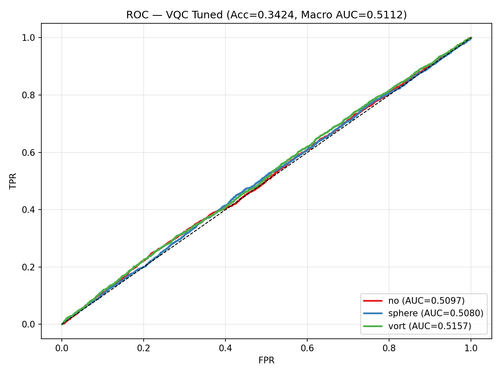
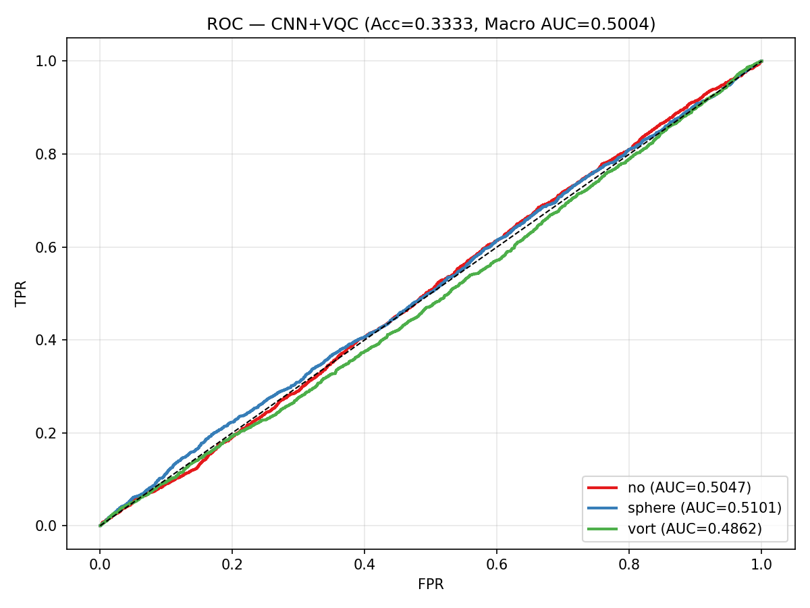

# DeepLense GSoC 2026 — Quantum Machine Learning

Gravitational lensing image classification using classical and quantum machine learning approaches, built with **PyTorch** and **NVIDIA CUDA-Q**.

## Task

Classify strong gravitational lensing images into 3 classes:
- `no` — no substructure
- `sphere` — subhalo substructure
- `vort` — vortex substructure

Dataset: 30,000 training + 7,500 validation images (150×150, single channel)

## Results

| Model | Val Accuracy | Macro AUC | Framework |
|-------|-------------|-----------|-----------|
| **Classical CNN (ResNet-18)** | **91.67%** | **0.9838** | PyTorch |
| VQC Tuned (PCA + 16 qubits) | 47.87% | 0.5112 | CUDA-Q |
| CNN + VQC (16 qubits) | — | 0.5004 | CUDA-Q + PyTorch |
| QCNN 8×8 (e2e, 16 qubits) | 34.47% | ~0.53 | CUDA-Q + PyTorch |

### CNN ROC Curve


### VQC (Tuned) ROC Curve


### CNN+VQC ROC Curve


## Project Structure

```
├── Test_I_Classical_CNN.ipynb              # Test I notebook
├── Test_III_VQC.ipynb                      # Test III: PCA + VQC
├── Test_III_VQC_tuned.ipynb                # Test III: PCA + VQC (tuned)
├── Test_III_CNN_VQC.ipynb                  # Test III: CNN features + VQC
├── Test_III_Quantum_QCNN.ipynb             # Test III: Quantum Conv (QCNN)
├── Test_III_VQC_executed.ipynb             # Executed notebook with outputs
├── Test_III_VQC_tuned_executed.ipynb       # Executed notebook with outputs
├── Test_III_CNN_VQC_executed.ipynb         # Executed notebook with outputs
│
├── model_cnn.py                            # ResNet-18 model
├── model_qcnn.py                           # Quantum Conv2d + Hybrid QCNN (16 qubits)
├── model_vqc.py                            # Variational Quantum Classifier
├── dataset.py                              # Dataset loader with PCA/downsample
├── evaluate.py                             # ROC/AUC evaluation utilities
├── train_cnn.py                            # CNN training script
├── train_qcnn.py                           # QCNN training (e2e + precompute modes)
├── precompute_qfeatures.py                 # Precompute quantum features
│
├── best_cnn.pt                             # Trained CNN weights
├── roc_*.png                               # ROC curve plots
└── data/                                   # Dataset (download separately)
```

## Setup

### Requirements
- Python 3.9+
- PyTorch 2.x with CUDA
- NVIDIA CUDA-Q 0.8+ (`pip install cuda-quantum`)
- scikit-learn, matplotlib, numpy

### Dataset
Download from [Google Drive](https://drive.google.com/file/d/1ZEyNMEO43u3qhJAwJeBZxFBEYc_pVYZQ/view) and extract:
```bash
pip install gdown
gdown --id 1ZEyNMEO43u3qhJAwJeBZxFBEYc_pVYZQ -O dataset.zip
unzip dataset.zip -d data_tmp && mv data_tmp/dataset data && rm -rf data_tmp dataset.zip
```

## Approach

### Test I: Classical CNN

ResNet-18 adapted for single-channel 150×150 input. Trained with SGD (lr=0.01, momentum=0.9, weight decay=5e-4, cosine annealing, 50 epochs).

**Result:** 91.67% accuracy, Macro AUC 0.9838

### Test III: Quantum ML with CUDA-Q

Four quantum approaches were explored, all using NVIDIA CUDA-Q with GPU-accelerated state vector simulation:

#### Method 1 — VQC (Variational Quantum Classifier)
```
Image (150×150) → Flatten → PCA (16 dims) → Angle Encoding (16 qubits)
    → Variational Circuit (3 layers, data re-uploading) → ⟨Z₀, Z₁, Z₂⟩ → 3 classes
```

#### Method 2 — CNN + VQC
```
Image → Pre-trained CNN (frozen) → 512-dim → Linear Projection → 16-dim
    → VQC (same as above) → 3 classes
```

#### Method 3 — QCNN (Quantum Convolution)
```
Image → Downsample (8×8 or 14×14) → Quantum Conv2d (4×4 kernel, 16 qubits, stride 4)
    → Classical FC layers → 3 classes
```

### Key Technical Choices

| Choice | Description |
|--------|-------------|
| **CUDA-Q** | GPU-accelerated quantum simulation (`nvidia` target) |
| **16 qubits** | 4×4 kernel (QCNN) or 16 PCA features (VQC) |
| **SPSA gradient** | O(1) circuit evaluations per backward pass, vs O(N_params) for parameter-shift |
| **Combined observable** | `Z₀ + Z₁ + ... + Z₁₅` in single `cudaq.observe()` for ~4× speedup |
| **Data re-uploading** | Re-encode input at each variational layer for higher expressivity |
| **Checkpoint resume** | Save/load model+optimizer state for multi-job training on HPC |

### Analysis

The quantum models significantly underperform the classical CNN. Key factors:

1. **Subtle class differences** — The 3 classes have nearly identical pixel statistics (mean ~0.06, std ~0.12). Even the classical CNN requires SGD with high momentum to break through, taking ~15 epochs before accuracy rises above 33%.

2. **SPSA gradient noise** — While SPSA is computationally efficient (2 circuit calls vs 192 for parameter-shift with 96 params), its gradient estimates are high-variance. The loss barely decreases from 1.099 (= log 3, random baseline) across all quantum approaches.

3. **Information bottleneck** — PCA to 16 dimensions preserves ~85% variance but loses discriminative detail. CNN features are more informative but the VQC still struggles to learn from them.

4. **Barren plateaus** — With 16 qubits and 3 layers, the gradient landscape may suffer from barren plateaus, making optimization difficult regardless of the gradient method.

## Running

### With SLURM (HPC)
```bash
# Train CNN
sbatch run_all.sh

# Run VQC notebooks
sbatch run_vqc.sh

# Resume interrupted training
sbatch run_resume.sh
```

### Local
```bash
# Test I: CNN
python train_cnn.py --data-dir data --epochs 50 --batch-size 128 --lr 0.01

# Test III: VQC (via notebook)
jupyter nbconvert --execute --to notebook --output executed.ipynb Test_III_VQC.ipynb

# Test III: QCNN (e2e)
python train_qcnn.py --mode e2e --data-dir data --epochs 30 --downsample 8 --target nvidia
```

## References

- Henderson et al., "Quanvolutional Neural Networks: Powering Image Recognition with Quantum Circuits" (2020)
- Pérez-Salinas et al., "Data re-uploading for a universal quantum classifier" (2020)
- Spall, "Multivariate Stochastic Approximation Using a Simultaneous Perturbation Gradient Approximation" (1992)
- NVIDIA CUDA-Q: https://nvidia.github.io/cuda-quantum/
