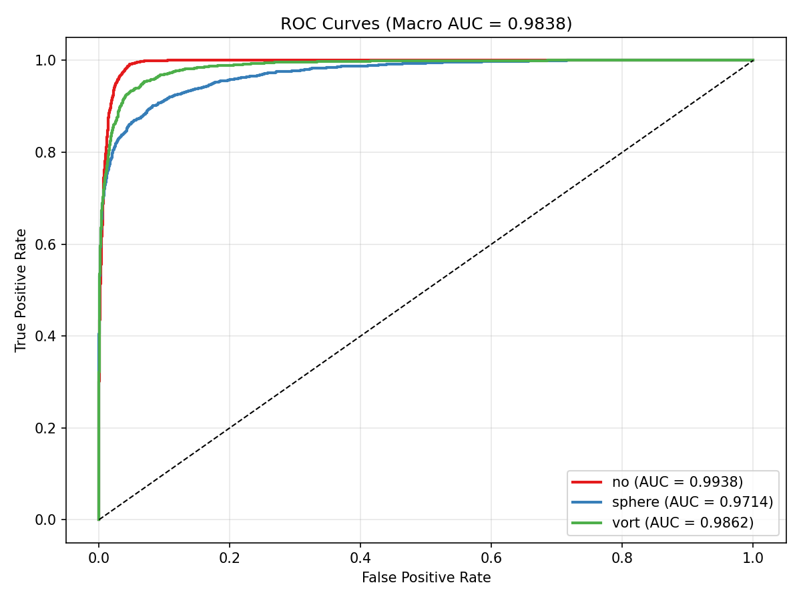

# DeepLense GSoC 2026 — Quantum Machine Learning

Gravitational lensing image classification using classical and quantum ML.

## Results

| Model | Val Accuracy | Macro AUC | Framework |
|-------|-------------|-----------|-----------|
| **Classical CNN (ResNet-18)** | **91.67%** | **0.9838** | PyTorch |
| VQC (PennyLane, 8 qubits) | TBD | TBD | PennyLane |

### CNN ROC Curve


## Project Structure

```
├── notebooks/
│   ├── Test_I_Classical_CNN.ipynb          # Test I: CNN baseline
│   └── Test_III_VQC_PennyLane.ipynb        # Test III: PCA + VQC (PennyLane)
├── src/
│   ├── dataset.py                          # Dataset loader
│   ├── model_cnn.py                        # ResNet-18
│   ├── model_vqc_pennylane.py              # VQC with PennyLane
│   ├── evaluate.py                         # ROC/AUC evaluation
│   ├── train_cnn.py                        # CNN training script
│   └── train_vqc.py                        # VQC training script
├── weights/
│   └── best_cnn.pt                         # Trained CNN weights
├── results/
│   └── roc_cnn.png                         # ROC curve
├── scripts/
│   └── run_notebooks.sh                    # SLURM job script
├── proposal.md                             # GSoC proposal
├── requirements.txt
└── data/                                   # Dataset (download separately)
```

## Setup

```bash
pip install -r requirements.txt
```

### Dataset
Download from [Google Drive](https://drive.google.com/file/d/1ZEyNMEO43u3qhJAwJeBZxFBEYc_pVYZQ/view) and extract:
```bash
pip install gdown
gdown --id 1ZEyNMEO43u3qhJAwJeBZxFBEYc_pVYZQ -O dataset.zip
unzip dataset.zip -d tmp && mv tmp/dataset data && rm -rf tmp dataset.zip
```

## Approach

### Test I: Classical CNN
ResNet-18 for single-channel 150×150 images. SGD (lr=0.01, momentum=0.9, cosine annealing, 50 epochs).

### Test III: Variational Quantum Classifier (PennyLane)

```
Image (150×150) → PCA (8 dims) → Angle Encoding (8 qubits)
    → VQC (3 layers, data re-uploading) → ⟨Z₀, Z₁, Z₂⟩ → 3 classes
```

- **PennyLane** with `parameter-shift` gradient (exact, no SPSA noise)
- `qml.qnn.TorchLayer` for native PyTorch autograd integration
- Data re-uploading for universal approximation [Pérez-Salinas et al., 2020]
- Ring CNOT entanglement topology

## Running

```bash
# Train CNN
python src/train_cnn.py --data-dir data --epochs 50

# Train VQC
python src/train_vqc.py --data-dir data --n-qubits 8 --epochs 30

# Or run notebooks (with SLURM)
sbatch scripts/run_notebooks.sh
```

## References

1. Alexander et al., "Deep Learning the Morphology of Dark Matter Substructure" (2020)
2. Pérez-Salinas et al., "Data re-uploading for a universal quantum classifier" (2020)
3. Henderson et al., "Quanvolutional Neural Networks" (2020)
4. PennyLane: https://pennylane.ai/
